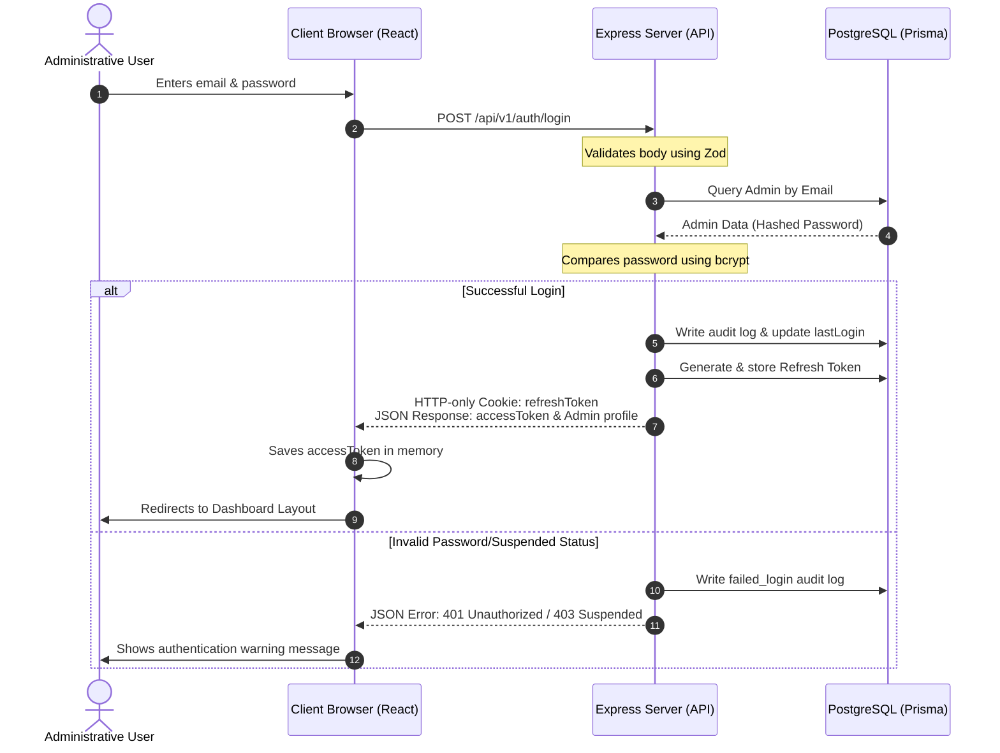

# Authentication & Authorization Architecture (Phase 2)

This document describes the design, implementation, strategies, API parameters, flowcharts, and security safeguards of the Authentication & Authorization system for the IUCB Admin Dashboard.

---

## 1. Authentication Flow Diagram



---

## 2. JWT Strategy

1. **Short-Lived Access Tokens**:
   - Transmitted in the `Authorization` header as a Bearer Token (`Bearer <JWT>`).
   - Lifetime: **15 minutes**.
   - Contains minimal claims for security:
     ```json
     {
       "id": "uuid-admin-id",
       "email": "admin@iucb.org",
       "role": "SUPER_ADMIN"
     }
     ```

2. **Middleware Verification (`protect`)**:
   - Intercepts requests, validates the signature, and decodes the token claims.
   - Verifies the user still exists in PostgreSQL and is active.
   - Attaches the sanitized admin metadata (excluding password) to the Express request context (`req.admin`).

---

## 3. Refresh Token Strategy

1. **Persistent Sessions**:
   - Sent to the client as an **HTTP-only secure cookie** (`refreshToken`) to prevent access from JavaScript (mitigates XSS).
   - Lifetime: **7 days**.
   - Stored as a cryptographically secure random string in the database.

2. **Token Rotation (Security Measure)**:
   - When calling `POST /api/v1/auth/refresh`, the server deletes the used refresh token and generates a new access token and fresh refresh token.
   - If the refresh token is expired or invalid, it is deleted from the DB, the cookie is cleared, and the user is redirected to the login page.

---

## 4. Security Considerations

- **Brute Force Protection**: Failed attempts are logged. Lockout mechanisms can be wired during future phases.
- **XSS Mitigation**: The refresh token is inaccessible to document script readers.
- **Token Leakage**: Clear claim footprint. Password hashing uses standard `bcryptjs` with 10 salt rounds.
- **Auditing**: Administrative triggers (`LOGIN`, `LOGOUT`, `PASSWORD_CHANGED`, `PASSWORD_RESET`) write entries to `AuditLog`.

---

## 5. API Documentation

### 1. `POST /api/v1/auth/login`
- **Request Body**:
  ```json
  {
    "email": "superadmin@iucb.org",
    "password": "SuperAdminPass123!"
  }
  ```
- **Response**:
  ```json
  {
    "success": true,
    "statusCode": 200,
    "message": "Logged in successfully",
    "data": {
      "accessToken": "eyJhbGciOi...",
      "admin": {
        "id": "uuid",
        "fullName": "IUCB Super Administrator",
        "email": "superadmin@iucb.org",
        "role": "SUPER_ADMIN",
        "status": "ACTIVE"
      }
    }
  }
  ```

### 2. `POST /api/v1/auth/logout`
- **Cookies**: Contains `refreshToken`.
- **Response**:
  ```json
  {
    "success": true,
    "statusCode": 200,
    "message": "Logged out successfully",
    "data": null
  }
  ```

### 3. `GET /api/v1/auth/me`
- **Headers**: `Authorization: Bearer <accessToken>`.
- **Response**:
  ```json
  {
    "success": true,
    "statusCode": 200,
    "message": "Profile fetched successfully",
    "data": {
      "admin": {
        "id": "uuid",
        "fullName": "IUCB Super Administrator",
        "email": "superadmin@iucb.org",
        "role": "SUPER_ADMIN",
        "status": "ACTIVE"
      }
    }
  }
  ```

### 4. `POST /api/v1/auth/refresh`
- **Cookies**: Contains `refreshToken`.
- **Response**:
  ```json
  {
    "success": true,
    "statusCode": 200,
    "message": "Token refreshed successfully",
    "data": {
      "accessToken": "eyJhbGciOi..."
    }
  }
  ```

---

## 6. Files Created in Phase 2

- **Backend Route Handlers & Validation**:
  - [auth.validators.ts](file:///c:/Users/Admin/OneDrive/Desktop/IUCB_INTERN/backend/src/validators/auth.validators.ts)
  - [auth.middleware.ts](file:///c:/Users/Admin/OneDrive/Desktop/IUCB_INTERN/backend/src/middlewares/auth.middleware.ts)
  - [auth.service.ts](file:///c:/Users/Admin/OneDrive/Desktop/IUCB_INTERN/backend/src/services/auth.service.ts)
  - [auth.controller.ts](file:///c:/Users/Admin/OneDrive/Desktop/IUCB_INTERN/backend/src/controllers/auth.controller.ts)
  - [auth.routes.ts](file:///c:/Users/Admin/OneDrive/Desktop/IUCB_INTERN/backend/src/routes/auth.routes.ts)
- **Frontend Authentication Views**:
  - [login.tsx](file:///c:/Users/Admin/OneDrive/Desktop/IUCB_INTERN/frontend/src/routes/login.tsx)
  - [forgot-password.tsx](file:///c:/Users/Admin/OneDrive/Desktop/IUCB_INTERN/frontend/src/routes/forgot-password.tsx)
  - [reset-password.tsx](file:///c:/Users/Admin/OneDrive/Desktop/IUCB_INTERN/frontend/src/routes/reset-password.tsx)
  - [unauthorized.tsx](file:///c:/Users/Admin/OneDrive/Desktop/IUCB_INTERN/frontend/src/routes/unauthorized.tsx)
  - [not-found.tsx](file:///c:/Users/Admin/OneDrive/Desktop/IUCB_INTERN/frontend/src/routes/not-found.tsx)

---

## 7. Testing Checklist

- [x] Verify invalid email formats and short passwords reject before requesting API (Zod client-side).
- [x] Verify correct logins generate access tokens and save HTTP-only cookies.
- [x] Test refresh token rotation on `/api/v1/auth/refresh` endpoint.
- [x] Check forgot-password triggers log in `EmailLog` table.
- [x] Verify reset-password hashes updating and revoking active sessions.
- [x] Test role middleware returns `403 Forbidden` if role is mismatched.
