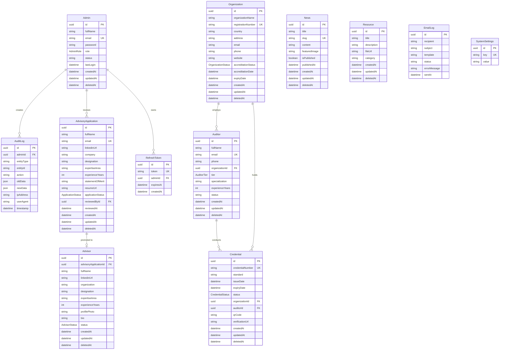

# Database Architecture & Design Documentation (Phase 1)

This document provides a detailed breakdown of the database schema, entity relationships, validation schemas, and physical schema designs configured for the IUCB Admin Dashboard.

---

## 1. Entity-Relationship Diagram (Mermaid)



---

## 2. Table Explanation

### Primary Domain Tables
1. **Admin**: Stores dashboard administrators. Necessary for credential access control, logs, and system operations.
2. **Organization**: Accreditation certification bodies operating under IUCB registry lookup parameters.
3. **Auditor**: Professionals conducting standard audits on behalf of accredited organizations.
4. **Credential**: Formal ISO certifications issued to corporate clients, searchable and validatable.
5. **AdvisoryApplication**: Candidates applying to join the advisory boards.
6. **Advisor**: Promoted advisors displayed publicly after application approval.
7. **News**: General portal bulletins, articles, and standards updates.
8. **Resource**: System guideline uploads and downloadable compliance PDF forms.

### Enterprise Security & Audit Log Tables
9. **RefreshToken**: Stores persistent sessions to sign new short-lived JWT credentials without prompting logins repeatedly.
10. **AuditLog**: Immutably registers actions performed by administrative accounts (entity changes, mutations).
11. **EmailLog**: Logs transactional template triggers (accrued delivery data, errors).
12. **SystemSettings**: Configures runtime parameters dynamically (e.g. maintenance flags) without redeployment.

---

## 3. Relationships & Cascade Actions

- **Organization (1) ➔ Auditor (Many)**: Deleted organizations trigger cascade deletions on their associated auditor entities.
- **Organization (1) ➔ Credential (Many)**: Deleted organizations trigger cascade deletions on credentials.
- **Auditor (1) ➔ Credential (Many)**: Deleted auditors trigger cascade deletions on credentials to maintain integrity.
- **AdvisoryApplication (1) ➔ Advisor (1)**: Advisors reference approved applications. Deleting an application cascades down to delete the matching advisor.
- **Admin (1) ➔ AuditLog (Many)**: Set Null constraints prevent deletion blocks on logs if an admin profile is deleted.
- **Admin (1) ➔ AdvisoryApplication (Many)**: Set Null triggers when an admin reviews an application, maintaining historical tracking if the reviewer is removed.

---

## 4. Entity Indexes
- **`email`**: Indexed for fast queries during authentication lookups (Admins, Auditors, Candidates).
- **`credentialNumber`**: Unique index to optimize quick public verification scans.
- **`registrationNumber`**: Unique index to search organizations rapidly.
- **`organizationName`**: Optimized for directory search lookups.
- **`status` / `createdAt`**: Filters dashboards, reports, and chronological lists.

---

## 5. Zod Validation Schemas (Zod Types Baseline)
These Zod schemas are designed for validating inputs in future controller routes:

```typescript
import { z } from "zod";

// Admin validation
export const createAdminSchema = z.object({
  fullName: z.string().min(2, "Full name must be at least 2 characters"),
  email: z.string().email("Invalid email address"),
  password: z.string().min(8, "Password must be at least 8 characters"),
  role: z.enum(["SUPER_ADMIN", "ADMIN"]).optional(),
});

// Organization validation
export const createOrgSchema = z.object({
  organizationName: z.string().min(2, "Organization name required"),
  registrationNumber: z.string().min(2, "Registration number required"),
  country: z.string().min(2, "Country required"),
  address: z.string().min(5, "Address required"),
  email: z.string().email("Invalid email address"),
  phone: z.string().min(5, "Phone number required"),
  website: z.string().url().optional().nullable(),
  accreditationStatus: z.enum(["ACTIVE", "SUSPENDED", "REVOKED"]).optional(),
  accreditationDate: z.coerce.date(),
  expiryDate: z.coerce.date(),
});

// Auditor validation
export const createAuditorSchema = z.object({
  fullName: z.string().min(2, "Full name required"),
  email: z.string().email("Invalid email address"),
  phone: z.string().min(5, "Phone required"),
  organizationId: z.string().uuid("Invalid Organization ID"),
  tier: z.enum(["ASSOCIATE", "SENIOR", "LEAD"]).optional(),
  specialization: z.string().min(2, "Specialization required"),
  experienceYears: z.number().int().min(0),
});

// Credential validation
export const createCredentialSchema = z.object({
  credentialNumber: z.string().min(5, "Credential number required"),
  standard: z.string().min(2, "Standard standard ID required"),
  issueDate: z.coerce.date(),
  expiryDate: z.coerce.date(),
  status: z.enum(["VALID", "REVOKED", "EXPIRED"]).optional(),
  organizationId: z.string().uuid("Invalid Organization ID"),
  auditorId: z.string().uuid("Invalid Auditor ID"),
  verificationUrl: z.string().url(),
});
```
